# TimelineUI

<a href="https://codeberg.org/ctietze/timeline-ui"></a>


A SwiftUI component library for displaying calendar timeline views in iOS apps. Show daily schedules on an hour grid with automatic layout for overlapping events.

## Installation

Add TimelineUI to your project using Swift Package Manager:

```swift
dependencies: [
    .package(url: "https://codeberg.org/ctietze/timeline-ui.git", from: "1.0.0")
]
```

> **Note:** This project is canonically hosted on [Codeberg](https://codeberg.org/ctietze/timeline-ui). GitHub is a mirror.

## Quick Start

```swift
import TimelineUI

struct ScheduleView: View {
    let events: [TimelineItem] = [
        TimelineItem(
            title: "Team Meeting",
            startDate: Date(),
            endDate: Date().addingTimeInterval(3600),
            color: .blue,
            location: "Conference Room A"
        ),
        TimelineItem(
            title: "Lunch",
            startDate: Date().addingTimeInterval(7200),
            endDate: Date().addingTimeInterval(10800),
            color: .green
        )
    ]

    var body: some View {
        DayTimelineView(items: events)
    }
}
```

## Components

### DayTimelineView

Full day timeline that automatically expands to fill available space. Shows hour grid lines with events positioned by time.

```swift
DayTimelineView(items: [TimelineItem])
```

### ZoomableDayTimelineView

Full day timeline with pinch-to-zoom on the hour grid. Unlike `DayTimelineView`, it always
lays out the full 24-hour day inside a scroll view and lets the user pinch (or trackpad-pinch
on macOS) to change the vertical scale — the hour under the zoom stays centered on screen.

```swift
ZoomableDayTimelineView(items: [TimelineItem])
```

### CompactTimelineView

Compact timeline window, ideal for widgets or previews.

```swift
CompactTimelineView(items: [TimelineItem])                      // Fills available height
CompactTimelineView(items: [TimelineItem], heightMode: .flexible)      // Same as above
CompactTimelineView(items: [TimelineItem], heightMode: .fixed(hours: 2)) // Fixed 2-hour window
```

### Expandable Timeline

Tap a compact timeline to expand into a full day view with a smooth matched geometry animation:


```swift
@State private var isExpanded = false
@Namespace private var timelineNamespace

// Compact view with tap-to-expand
CompactTimelineView(items: items, heightMode: .fixed(hours: 2))
    .timelineTransition(in: timelineNamespace)
    .onTapGesture {
        withAnimation(.spring(duration: 0.4, bounce: 0.15)) {
            isExpanded = true
        }
    }

// Apply expanded overlay at root level
.overlay {
    if isExpanded {
        ExpandedTimelineContent(items: items) { headerView }
            .timelineTransition(in: timelineNamespace)
    }
}
```

### Week Strip Toolbar

A locale-aware 7-day week strip with single-letter weekday headers and the selected day
highlighted, similar to Apple Calendar's day-view header. Swipe (or click-drag on macOS) and
the chevron buttons page between weeks; tapping a day selects it. The weekday letters and
first day of the week both follow the given `Calendar`'s locale — a Monday-first locale shows
`M T W T F S S`, a Sunday-first locale shows `S M T W T F S`:

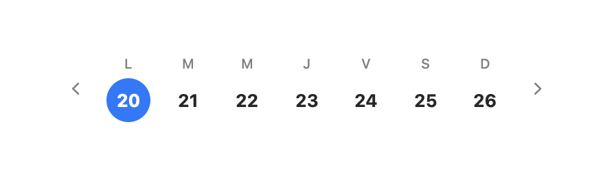

```swift
@State private var selectedDate = Date()

WeekStripView(selectedDate: $selectedDate)
```

Pair it with a scrollable day timeline via `WeekTimelineView`, which pins the week strip above
a `ZoomableDayTimelineView` and coordinates the selection between them. Supply `items` already
filtered to `selectedDate`, and update them whenever the binding changes:

```swift
WeekTimelineView(items: eventsForSelectedDay, selectedDate: $selectedDate)
```

### Access Restricted View

Show a blurred timeline with a permission prompt when calendar access hasn't been granted:

```swift
CompactTimelineView(items: [])
    .accessRestricted(!hasCalendarAccess) {
        AccessPromptView.calendar(style: .compact) {
            await requestCalendarAccess()
        }
    }
```

Customize the prompt text:

```swift
AccessPromptView.calendar(
    title: "Check for conflicts",
    message: "See if this time works with your schedule",
    buttonLabel: "Enable Calendar"
) { await requestAccess() }
```

Or use ViewBuilders for full control over icon and button:

```swift
AccessPromptView(
    title: "Connect Calendar",
    message: "Show your events on the timeline",
    icon: { Image(systemName: "calendar.badge.plus") },
    buttonLabel: { Label("Allow Access", systemImage: "checkmark.circle") }
) { await requestAccess() }
```

## Screenshots

| | Light | Dark |
|---|:-----:|:----:|
| **Compact** - Focused 2-3 hour window | 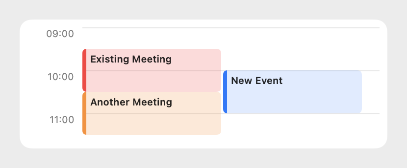 | 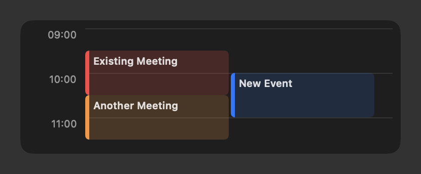 |
| **Day** - Full schedule with hour grid | 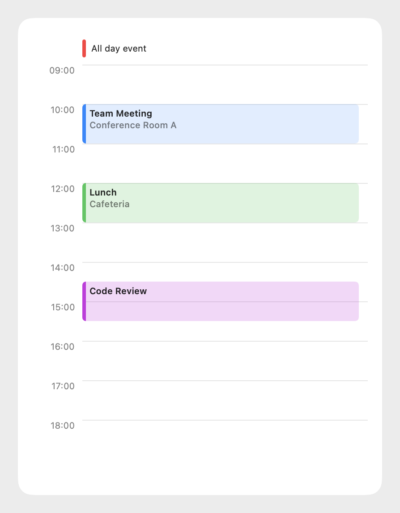 | 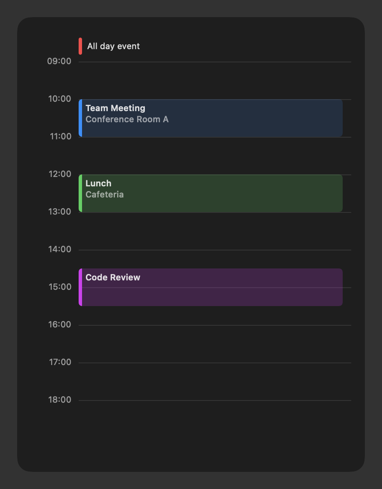 |
| **Overlapping** - Events arranged side-by-side | 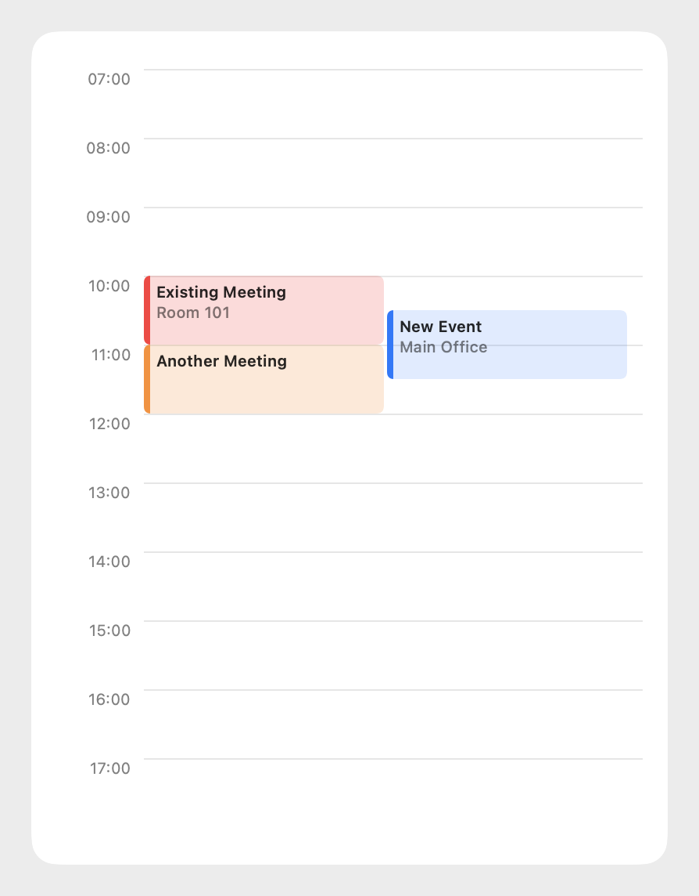 | 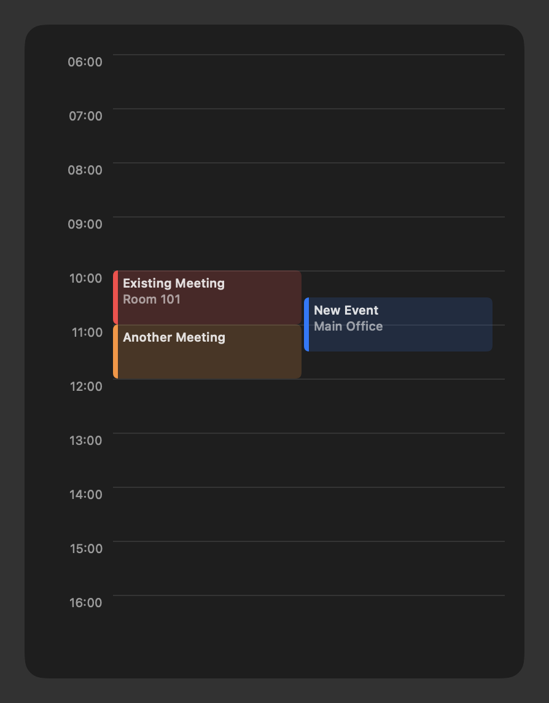 |
| **Many events** - Handles busy schedules gracefully | 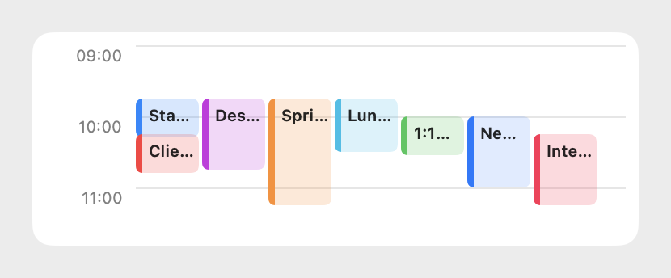 | 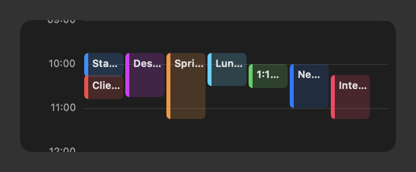 |
| **Zoomable day** - Default pinch-zoom level | 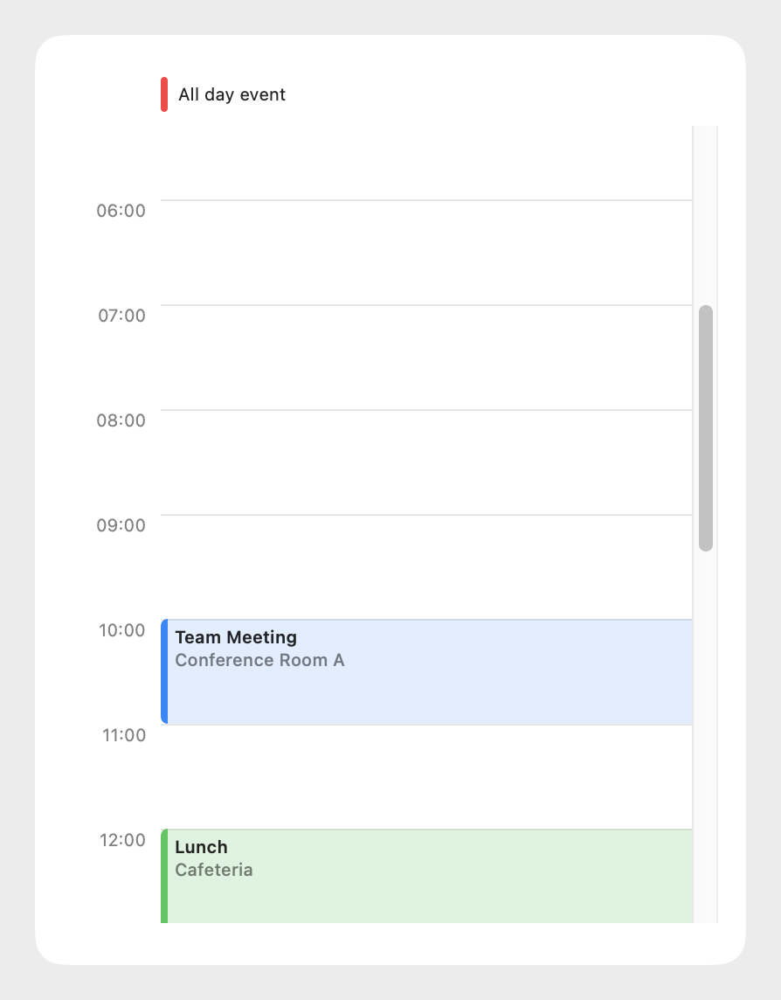 | 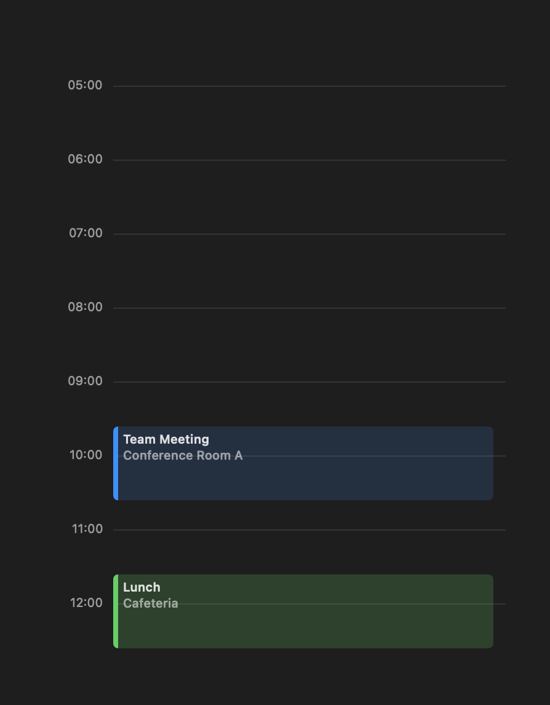 |
| **Zoomable day** - Zoomed out to fit the whole day | 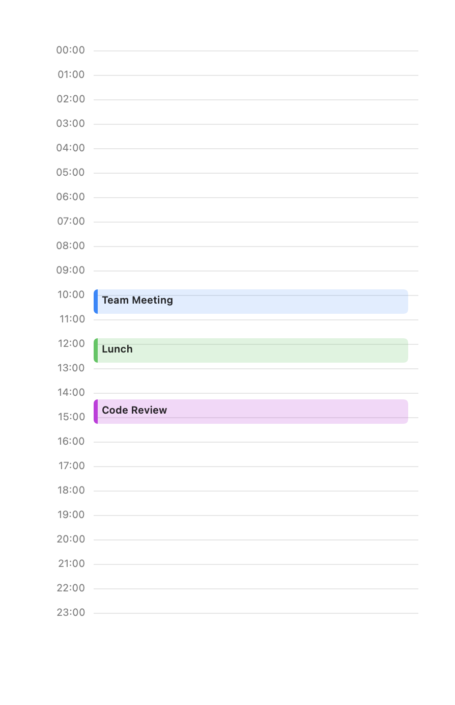 | 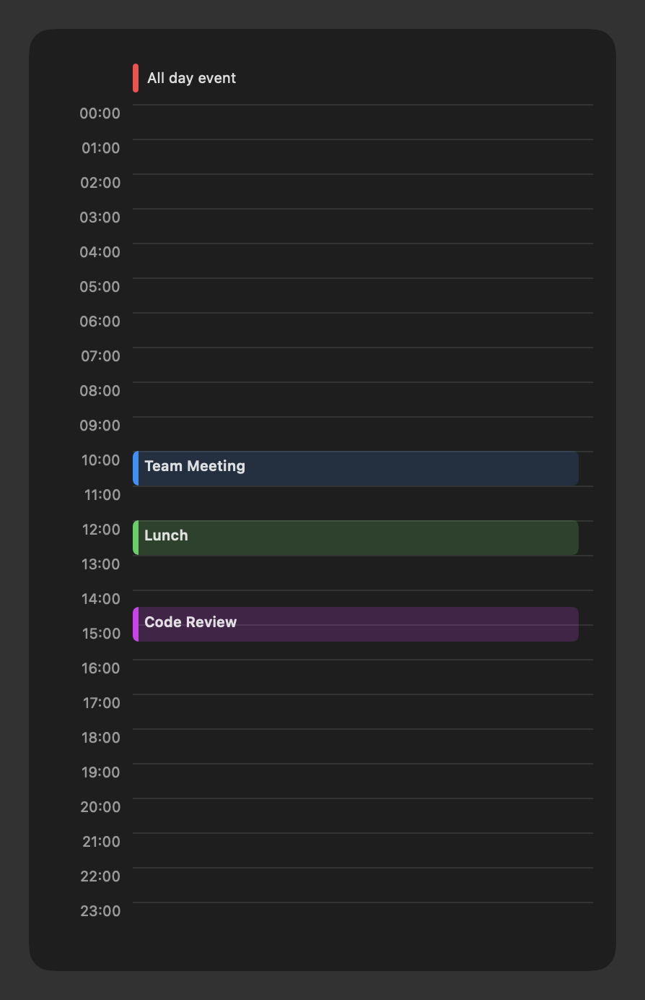 |
| **Week strip** - Locale-aware toolbar with swipe/chevron navigation | 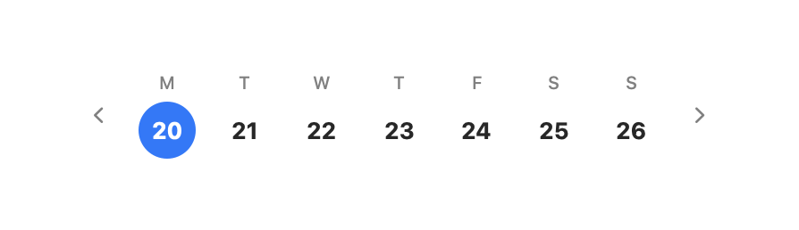 | 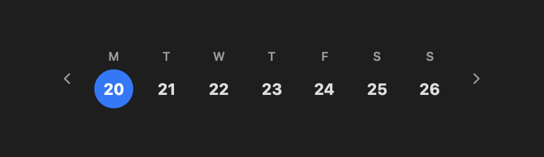 |
| **Week timeline** - Week strip pinned above a zoomable day timeline | 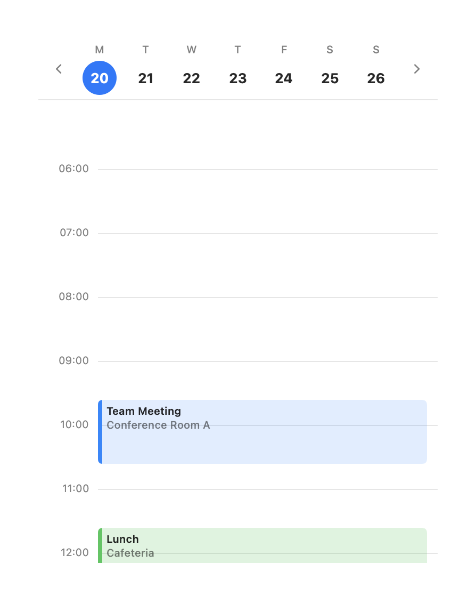 | 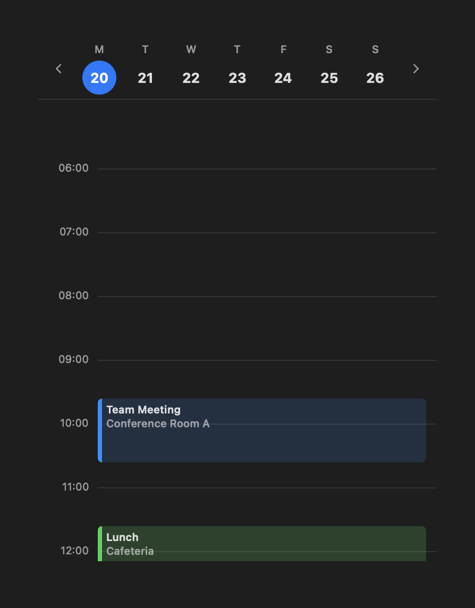 |
| **Access restricted** - Blurred with permission prompt |  |  |

## Requirements

- iOS 26+
- macOS 15+
- Swift 6.2+

## License

MIT
